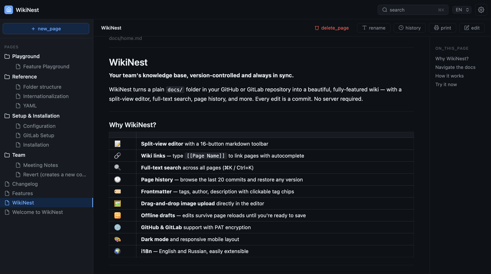

# WikiNest

**Your wiki is just a Git repository.**

WikiNest is a git-native wiki for small engineering teams. Edit markdown in the browser. Every edit becomes a commit. No backend. No database. No build step.

[](https://claude.ai/chat/LICENSE)[](https://claude.ai/chat/CHANGELOG.md)[](https://pages.github.com/)[](https://docs.gitlab.com/ee/user/project/pages/)[](https://claude.ai/chat/CONTRIBUTING.md)

```
Browser ↔ Git provider API ↔ Git repository ↔ Pages
```


✓ Browser-based markdown editor ✓ Every edit becomes a commit ✓ Runs on GitHub or GitLab Pages — free forever ✓ No backend ✓ No database ✓ No build step ✓ Open `index.html` locally and the entire app works

The entire frontend is one `index.html` and one `style.css`. No `npm install`. No `node_modules`. No framework runtime.

---

## What WikiNest is not

* **Not a CMS** — no admin panel, no content types, no database
* **Not a static site generator** — no build step, no npm, no local toolchain
* **Not a wiki engine** — no server, no plugins, no self-hosted infra
* **Not Notion** — your content stays in a Git repo you own, not in someone's SaaS

WikiNest is a thin editing layer over the Git provider API. Your repository is the backend.

---

## Why not another wiki?

Most team documentation tools eventually become infrastructure.

* **Confluence** → SaaS lock-in, \$10+/user/month
* **Wiki.js** → server + database + Docker
* **Docusaurus** → Node.js + build pipeline
* **Obsidian** → not collaborative
* **Notion** → not git-native

WikiNest treats Git as the storage layer instead of syncing with one later. Git already solved collaboration, history, and deployment. WikiNest simply builds a wiki on top of it.

---

## Demo

> **Live demo:** [keegooroomie.github.io/wikinest](https://keegooroomie.github.io/wikinest)



<!-- Add GIF here: edit → drag image → Ctrl+S → deploy indicator → GitHub commit -->

---

## Compare


|                 | WikiNest | Wiki.js | Confluence | Docusaurus | Obsidian Publish |
| --------------- | :------: | :-----: | :--------: | :--------: | :--------------: |
| No backend      |    ✅    |   ❌   |     ❌     |     ✅     |        ✅        |
| No database     |    ✅    |   ❌   |     ❌     |     ✅     |        ✅        |
| No build step   |    ✅    |   ❌   |     ❌     |     ❌     |        ✅        |
| Git-native      |    ✅    | partial |     ❌     |     ✅     |        ❌        |
| Browser editing |    ✅    |   ✅   |     ✅     |     ❌     |        ❌        |
| Self-hosted     |    ✅    |   ✅   |     ❌     |     ✅     |        ❌        |
| Free hosting    |    ✅    |   ❌   |     ❌     |     ✅     |        ❌        |
| GitHub Pages    |    ✅    |   ❌   |     ❌     |     ✅     |        ❌        |
| GitLab Pages    |    ✅    |   ❌   |     ❌     |  partial  |        ❌        |

---

## Features

### Split-view editor

Markdown on the left, live preview on the right — debounced so it doesn't jank on large documents. 16-button toolbar covers the full markdown spec. Ctrl+S / ⌘S saves without leaving the keyboard.

### Offline drafts

The editor autosaves to `localStorage` every 500ms. If you close the tab mid-edit, a restore banner appears on return. Drafts are cleared on successful save.

### Drag-and-drop images

Drop an image onto the editor. It gets committed to `docs/assets/` via the API and `` is inserted at the cursor. One gesture, one commit.

### Wiki links

Type `[[Page Name]]` to link to any page. A live autocomplete dropdown appears after `[[`, navigable with arrow keys. Broken links render as a red strikethrough so you notice them immediately.

### Page history

A clock button in the content bar lists the last 20 commits for the current page. Click any commit to preview the markdown at that SHA. One click to restore — it loads into the editor with unsaved-changes protection.

### Full-text search

`search.json` is generated by CI and contains the full raw content of every page. The frontend fetches it lazily on first search open. Results beyond title/excerpt matches get a "Full text" badge. Open with ⌘K / Ctrl+K.

### Folder management

Folders are created automatically from page paths. Hover any folder in the sidebar to reveal a pencil icon — click it to rename the display name. WikiNest writes `_meta.json` in one commit; the actual paths and URLs stay unchanged.

### Custom home page

Place `docs/home.md` in your wiki and it auto-loads on the first visit instead of the empty state. Delete it to revert to the recently-modified list.

### Everything else

Unlimited nested folders · TOC with anchor deep-links · recently modified pages · frontmatter tags and author · live CI deploy status · per-file deploy indicators (●/✓/✗) · dark mode · EN/RU i18n · Print/PDF · mobile sidebar

---

## Quick start

### GitHub

**1.** Fork this repository. Go to **Settings → Pages → Source → GitHub Actions**. Go to **Settings → Actions → General → Workflow permissions → Read and write permissions**.

**2.** Edit `config.json`:

```json
{
  "site_name": "My Wiki",
  "lang": "en",
  "provider": "github",
  "owner": "your-github-username",
  "repo": "wikinest",
  "edit_password_hash": ""
}
```

**3.** Create a PAT — GitHub → Settings → Developer settings → Personal access tokens. Required scope: `repo` ✓

**4.** Open your Pages URL. Click **⚙**, enter PAT and edit password. Done.

Deployment time: \~2 minutes.

---

### GitLab

**1.** Fork on GitLab. Pages are enabled automatically for public repositories.

**2.** Settings → CI/CD → Variables → add `GITLAB_TOKEN` (PAT with `api` scope, masked).

**3.** Edit `config.json` — same as above but `"provider": "gitlab"`.

**4.** Open your Pages URL. Click **⚙**, enter PAT and edit password. Done.

---

## How it works

**Read path**

```
Browser → raw CDN → markdown files
```

**Write path**

```
Browser → Git provider API → commit → CI rebuild → Pages deploy
```

No synchronization layer. No hidden database. No separate storage.

The repository is the source of truth.

---

## Security model

WikiNest is designed for internal documentation, engineering teams, and semi-public knowledge bases.

Editing requires: repository write access + Personal Access Token + edit password.


| Protected                            | Not protected                             |
| ------------------------------------ | ----------------------------------------- |
| PAT (XOR-obfuscated in localStorage) | Page content (public repo)                |
| Edit UI (password-gated)             | `config.json`(public, readable by anyone) |
| Commits (require valid PAT)          | Password hash (SHA-256, one-way)          |

This is intentionally lightweight. WikiNest optimizes for simplicity and deployability, not enterprise-grade auth complexity.

**Generating the password hash manually:**

```js
const pw = 'your-password';
const buf = await crypto.subtle.digest('SHA-256', new TextEncoder().encode(pw));
console.log(Array.from(new Uint8Array(buf)).map(b => b.toString(16).padStart(2,'0')).join(''));
```

---

## Project structure

```
wikinest/
├── index.html          ← entire frontend SPA
├── style.css           ← all styles, CSS variables, dark mode
├── config.json         ← site config (owner, repo, password hash)
├── tree.json           ← page index, auto-generated by CI
├── search.json         ← full-text index, auto-generated by CI
├── i18n/               ← UI strings (en, ru)
├── docs/               ← your markdown pages
├── .github/workflows/  ← GitHub Actions (deploy + build-tree)
└── .gitlab-ci.yml      ← GitLab CI (build-tree + pages)
```

---

## Roadmap

* [ ]  Mermaid diagram support
* [ ]  Backlinks panel
* [ ]  Diff viewer in history modal
* [ ]  Tags browser page
* [ ]  Frontmatter GUI in ⚙ settings
* [ ]  Find & Replace in editor
* [ ]  Configurable themes
* [ ]  Staleness warnings for old pages

---

## Contributing

PRs are welcome. For large changes, open an issue first.

No setup required. No build step. Open `index.html` in a browser and start hacking.

**Conventions:**

* Commits: `feat:``fix:``docs:``chore:`
* No external dependencies beyond the existing CDN script
* All new UI strings must have entries in both `en.json` and `ru.json`
* Test dark mode before submitting UI changes

---

## Philosophy

WikiNest exists because documentation should not require infrastructure.

A repository already gives you version history, rollback, collaboration, access control, hosting, and review flow.

Git already solved the hard parts. WikiNest simply builds a wiki on top of it.

---

## License

[MIT](https://claude.ai/chat/LICENSE) — © 2026 Alexander Gusarov ([@KeeGooRoomiE](https://github.com/KeeGooRoomiE))
