# Регламент создания и настройки учётной записи клиента

## Шаг 1 — Создание учётной записи в 1С

В 1С открыть карточку контрагента. Перейти в **Системы мониторинга** и нажать кнопку **«Создать»**.

Далее выбрать нужный сервер и действовать по соответствующему разделу ниже:

- [AXENTA](#axenta) — для клиентов филиалов г. Кемерово и г. Екатеринбург
- [Глонасс Soft](#глонасс-soft) — для всех остальных клиентов

---

## AXENTA

### 1. Создание учётной записи

1. Открывшаяся форма выглядит следующим образом:

   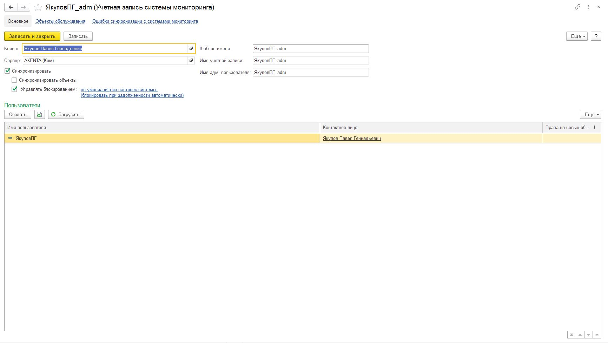

2. Выбрать сервер:
   - **г. Кемерово** → `AXENTA (Кем)`
   - **г. Екатеринбург** → `AXENTA (Екб)`

3. Шаблон имени заполнится автоматически — можно оставить или сократить. Префикс и постфикс добавляются автоматически.

   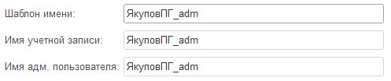

4. Проставить галочки как на скриншоте (галочку **«Синхронизировать объекты»** поставим позже):

   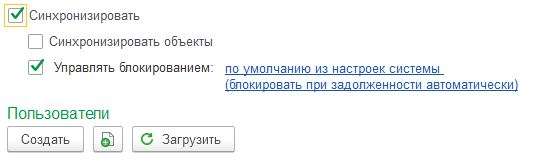

   Нажать **«Записать»**. Если имя уже занято в AXENTA — появится предупреждение; изменить шаблон имени и повторить.

   Спуститься вниз к таблице **«Пользователи»**:

   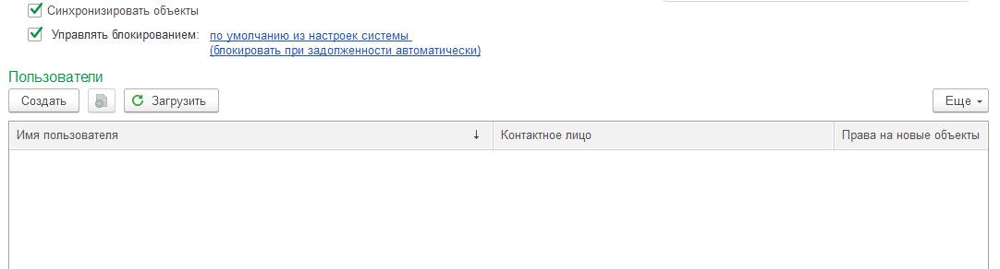

   Нажать **«Создать»**. Ввести тот же шаблон имени, что при создании административного пользователя. Галочку «Префикс/постфикс» оставить.

   Если все новые ТС должны добавляться в просмотр этому пользователю — установить галочку **«Назначать права на новые объекты»**.

   Нажать **«Записать и закрыть»** на карточке пользователя, затем **«Записать и закрыть»** на карточке учётной записи.

   Через несколько минут учётная запись, административный пользователь и пользователь клиента будут созданы в AXENTA.

5. В CMS перейти в раздел **«Пользователи»**:

   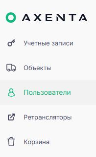

   Распределение ролей:
   - **Пользователь №1** (ЯкуповПГ) — передаётся клиенту
   - **Пользователь №2** — административный, работает специалист ТП

   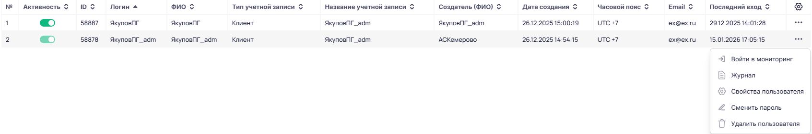

   Как различить пользователей:
   - 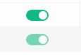 В графе **«Активность»** у административного пользователя зелёная кнопка некликабельна и имеет более бледный оттенок
   - По графе **«Создатель (ФИО)»** — у пользователя №1 прописано `ЯкуповПГ_adm`

   > Для синхронизации с 1С необходимо выдать **«права администратора»** на административного пользователя.

   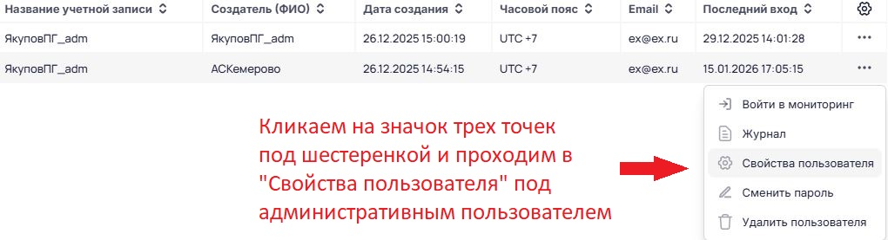
   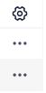
   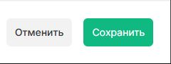
   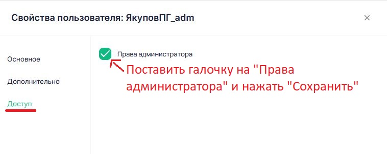

6. После выдачи «административных прав» вернуться в 1С и поставить галочку **«Синхронизировать объекты»**, затем нажать **«Записать и закрыть»**.

   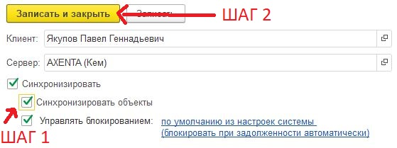

---

### 2. Настройка кабинета клиента

Открыть административного пользователя. ТС создаются и настраиваются под этим пользователем.

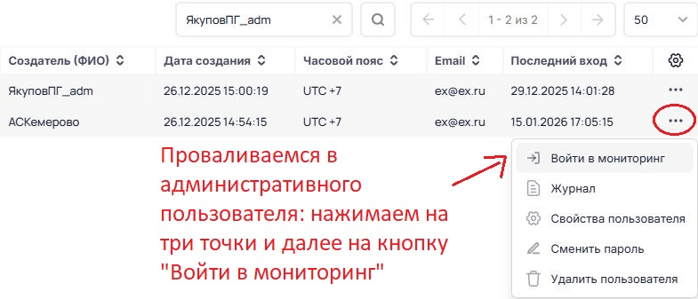

#### 2.1 Загрузка шаблонов отчётов

Раздел **«Отчёты»** (шаг 1) → вкладка **«Шаблоны»** (шаг 2) → **«Создать из файла»** (шаг 3). Выбрать отчёт:
- **«Общий по машине»** — если ТС одна
- **«Общий по группе»** — если ТС несколько

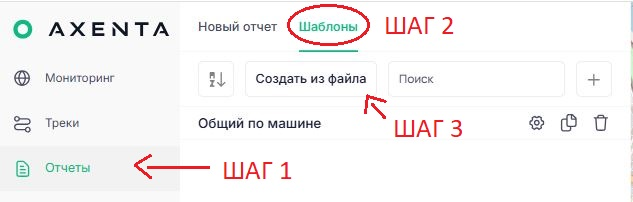

Выбрать файл «Бланк отчётов», нажать **«Загрузить»**. В таблице «Что импортировать» выбрать нужные отчёты.

#### 2.2 Создание пользователя

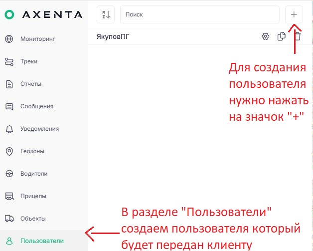

В разделе **«Пользователи»** нажать **«+»** и создать пользователя.

#### 2.3 Выдача прав

В разделе **«Пользователи»** (шаг 1) нажать значок **«шестерёнки»** (шаг 2) напротив нужного пользователя.

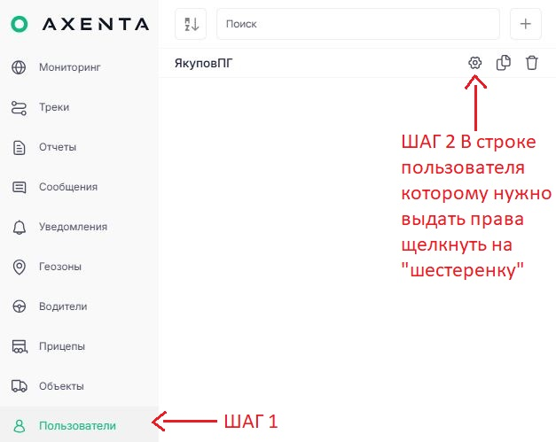

Вкладка **«Доступ»** → раздел **«Общий доступ»** → проставить галочки как на скриншоте:

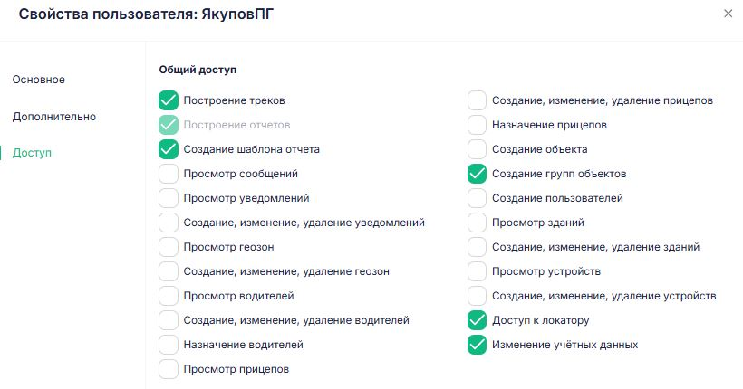

Из списка объектов выбрать нужное ТС, выбрать **«Шаблон прав доступа»** и проставить галочки:

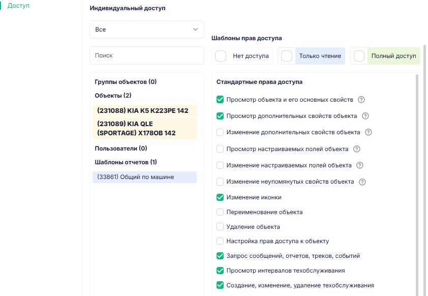
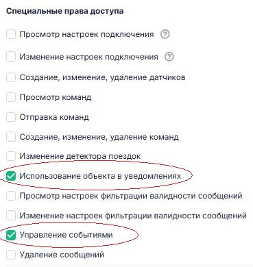

Для шаблона отчётов — выделить нужный шаблон, поставить галочку **«Только чтение»**.

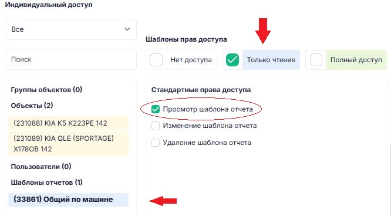

Нажать большую зелёную кнопку **«Сохранить»**:

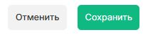

#### 2.4 Настройки под пользователем клиента

Открыть пользователя без постфикса `_adm`:

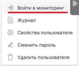
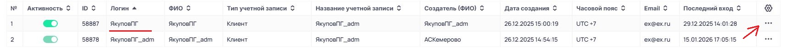

В левом нижнем углу: **«Настройки»** → **«Мои настройки»**:

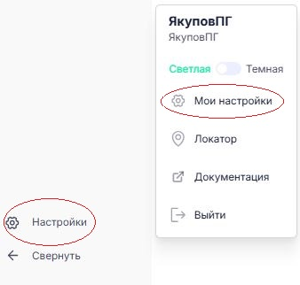

**Основные настройки** — изменить часовой пояс, при необходимости логин/ФИО/почту клиента.

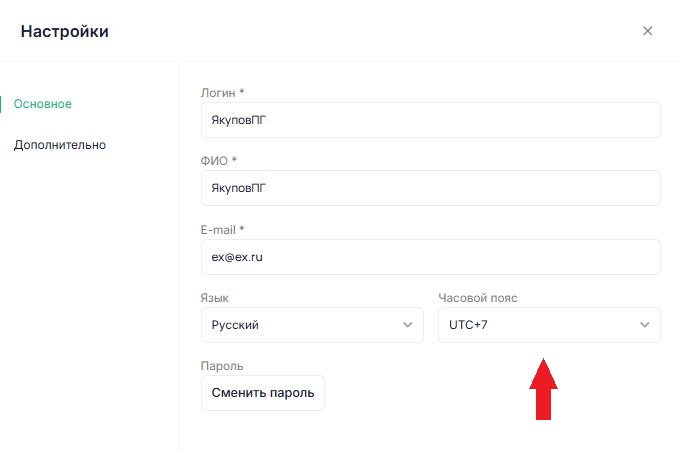

Вкладка **«Дополнительно»** — настроить отображение информационного окна ТС и вкладок клиента согласно скриншотам:

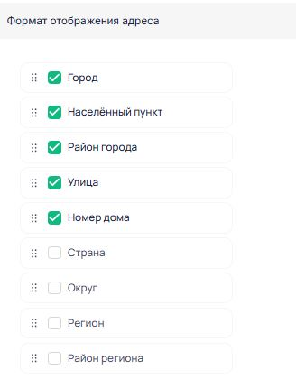 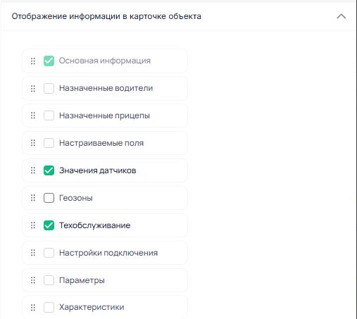

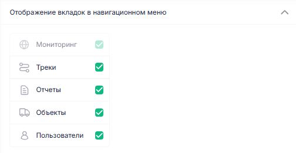

#### 2.5 Конечный результат

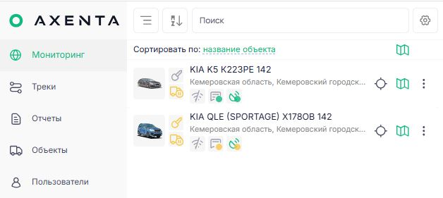

Информационное окно объекта:

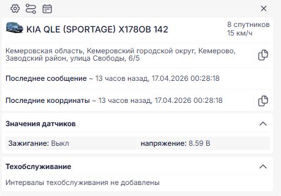

---

### 3. Создание шаблона на сайте

Перейти на [account.avtoscan42.ru](http://account.avtoscan42.ru). Ввести логин и пароль клиента, выбрать систему мониторинга **АКСЕНТА** и нажать **«Отправить менеджеру»**, выбрав менеджера из списка.

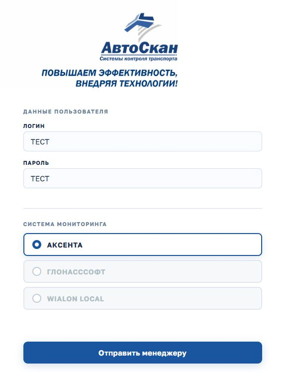

---

---

## Глонасс Soft

### 1. Создание учётной записи и пользователя

1. Открывшаяся форма выглядит следующим образом:

   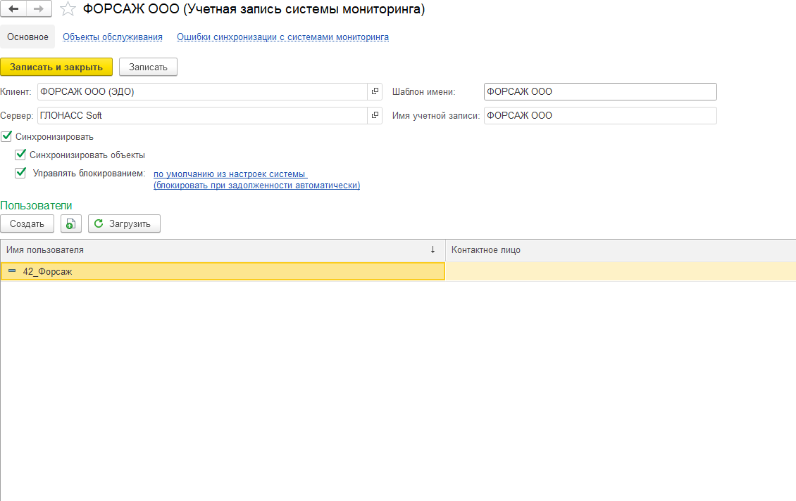

2. Выбрать сервер **«ГЛОНАСС Soft»**.

3. Проставить все галочки как на скриншоте.

4. Шаблон имени заполнится автоматически — можно оставить или изменить.

   

5. Нажать **«Записать»**, затем спуститься к таблице **«Пользователи»**:

   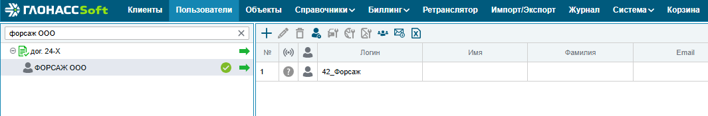

   Нажать **«Создать»**. Ввести тот же шаблон имени. Если все новые ТС должны добавляться в просмотр — установить галочку **«Назначать права на новые объекты»**.

   Нажать **«Записать и закрыть»** на карточке пользователя, затем **«Записать и закрыть»** на карточке учётной записи.

   Через несколько минут клиент и пользователь будут созданы в Глонасс Soft.

---

### 2. Настройка клиента и пользователя

1. После создания учётной записи перейти в созданного клиента → раздел **«Пользователи»**.

   

2. Двойным нажатием на логин открыть настройки пользователя. Перейти на вкладку **«Права доступа»** → **«Системные роли»** → поставить галочку на **«Пользователь+»**:

   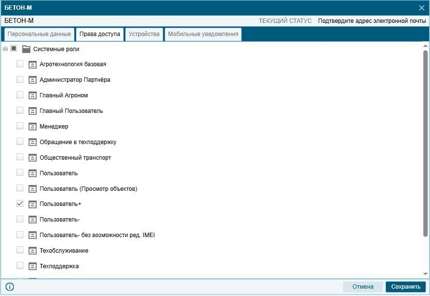

   Роль **«Пользователь+»** включает:
   1. Доступ к просмотру объектов
   2. Доступ к просмотру созданных датчиков (Топливо, зажигание и т.д.)
   3. Изменение иконки
   4. Создание и редактирование произвольных полей
   5. Нормы для ТО
   6. Доступ к созданию, редактированию геообъектов
   7. Доступ к базовым отчётам, конструктору отчётов, отчёт «Трек»
   8. Создание, редактирование путевых листов
   9. Создание, редактирование уведомлений

3. Во вкладке **«Персональные данные»** установить пароль и прописать его в поле **«Описание»** или **«Должность»**.

   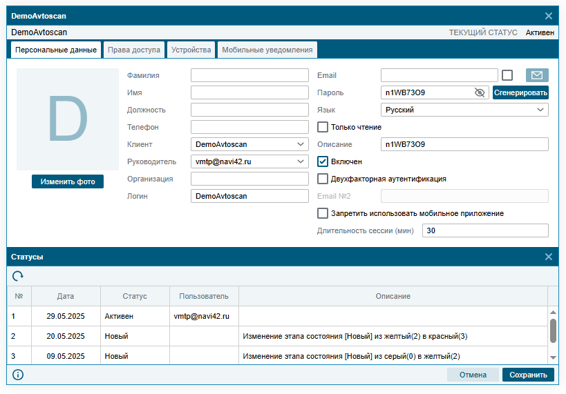

4. Перейти в раздел **«Справочники»** → **«Группы»**. Создать группу с наименованием клиента, добавить все ТС и нажать **«Сохранить»**.

   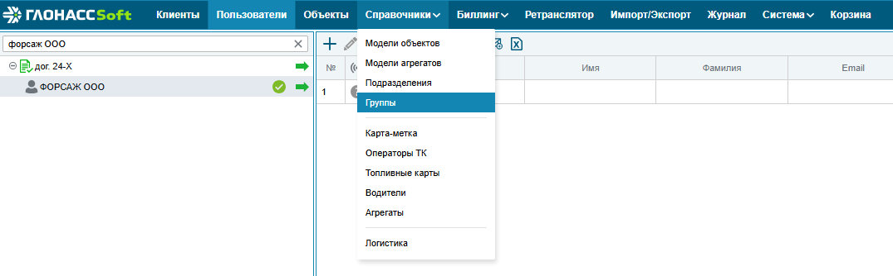
   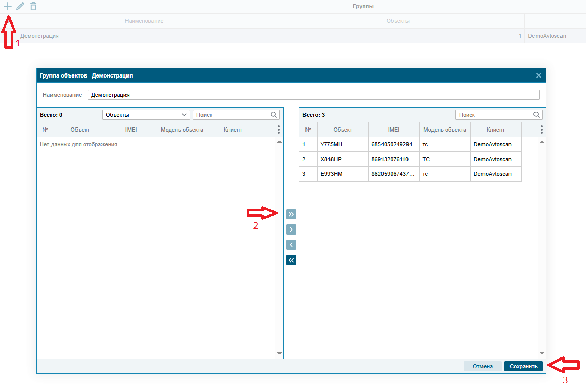

5. В разделе **«Справочники»** → **«Модели объектов»** в **«Модель по умолчанию»** изменить иконку на **«Автомобиль Бизнес (Синий)»**.

   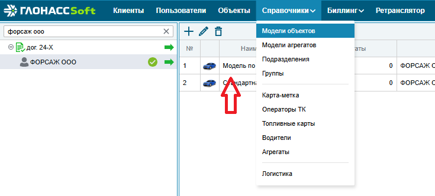
   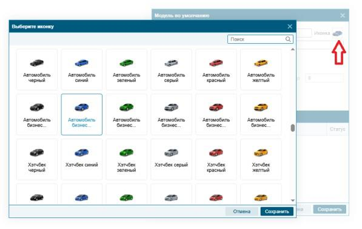

---

### 3. Настройка учётной записи

1. Войти в мониторинг под логином и паролем созданной учётной записи, открыть **«Настройки»**.

   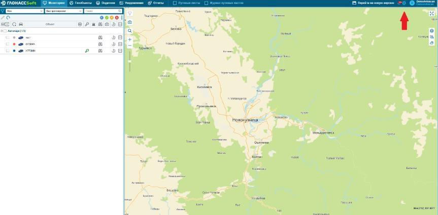

2. Вкладка **«Общее»** — отметить **«Сохранять выбор элементов при обновлении страницы»**.

   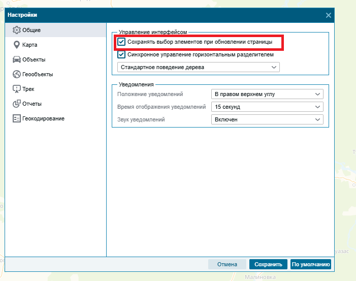

3. Вкладка **«Объекты»** — **убрать** отметку «Группировка объектов» и **отметить** «Показывать след за объектом» с установкой цвета следа.

   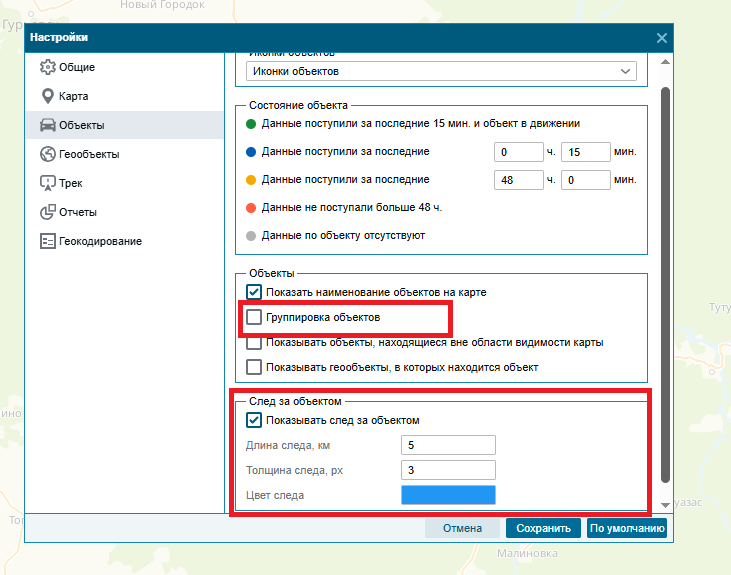

4. Вкладка **«Трек»** — отметить **«Чередовать цвета при построении отчётов»** и **«Показывать аннотации к треку»**.

   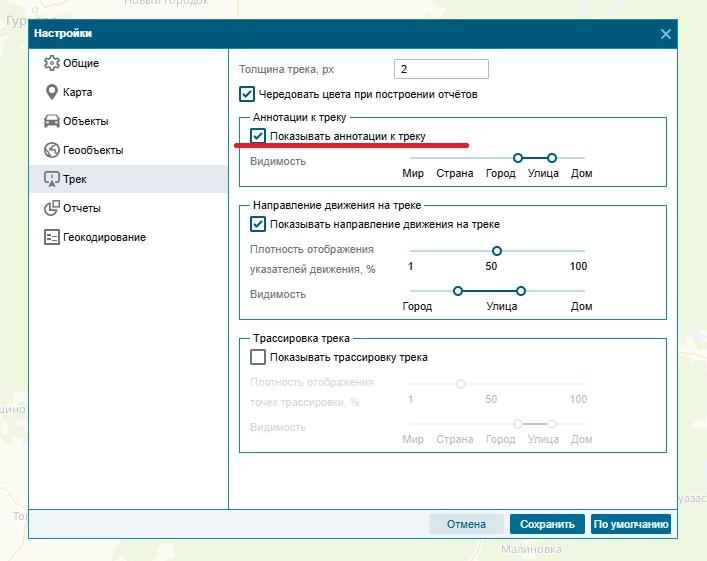

5. Вкладка **«Отчёты»** — нажать **«Загрузить отчёт»**, загрузить отчёт **«Общий по машине»** и проставить все галочки в конструкторе отчёта.

   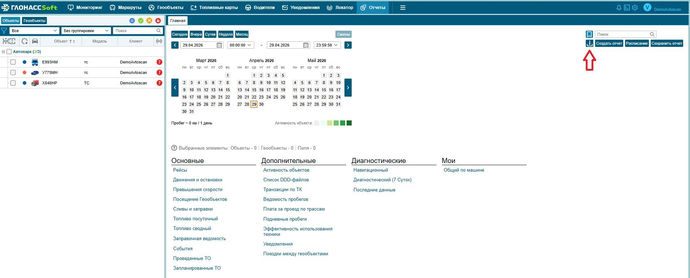

6. Проставить все галочки в конструкторе отчёта и сохранить настройки.

   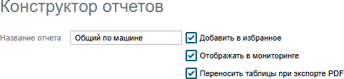

---

### 4. Создание шаблона на сайте

Перейти на [account.avtoscan42.ru](http://account.avtoscan42.ru). Ввести логин и пароль клиента, выбрать систему мониторинга **ГЛОНАСССОФТ** и нажать **«Отправить менеджеру»**, выбрав менеджера из списка.

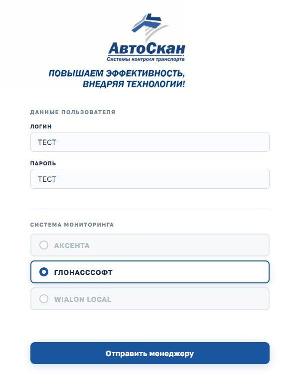
